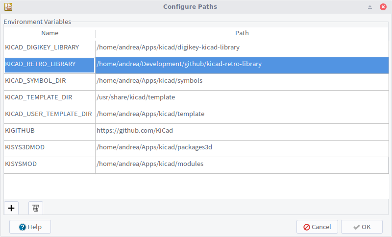
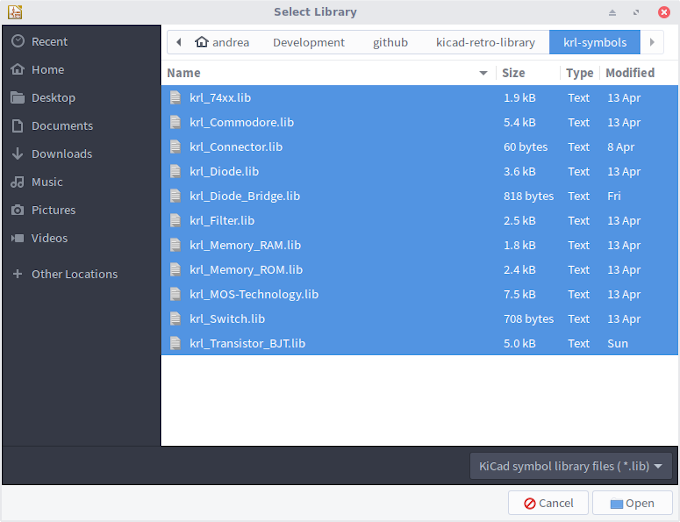

# KiCad Retro Library

## Table of Contents

<!-- TOC -->
- [Introduction](#introduction)
- [How to use this library](#how-to-use-this-library)
  - [Prepare KiCad](#prepare-kicad)
  - [Add symbols to a project](#add-symbols-to-a-project)
  - [Add footprints to a project](#add-footprints-to-a-project)
- [License](#license)
<!-- /TOC -->

## Introduction

A set of KiCad libraries for creating old computers schematics and PCBs.

The criteria for adding symbols and footprints to this library are the following:

- The component should not be already available in the official KiCad Libraries.
- The component is interesting for recreating the schematic and PCB of an
  old computer. This criteria is not strict, send a PR and we'll figure it out.

The library is designed to work on KiCad v5.1.

## How to use this library

The best approach is having a single copy of this library somewhere on your
HD and add it as a **Project Specific Library** to each project.

To make the designs more portable it is highly recommended to follow these steps:

### Prepare KiCad

1. Open the main KiCad application and select the _"Preferences -> Configure Paths..."_
   menu entry. The current project is not important.
2. Click on the **+** button in the bottom left corner to add a new environment variable.
3. Define the `KICAD_RETRO_LIBRARY` environment variable pointing to the absolute
   path where this repository has been cloned. E.g. `/home/user/dev/github/kicad-retro-library`.
4. Click **OK** to confirm.
5. Exit the KiCad application.

Example for KiCad 5.1.x:

### Add symbols to a project

1. Open the main KiCad application and select a project or create a new one.
2. Select the _"Preferences -> Manage Symbol Libraries..."_ menu entry.
3. Select the _"Project Specific Libraries"_ tab.
4. Click on the folder-shaped button (_"Add existing library to table"_) in the
   bottom left side of the dialog and navigate to the `krl-symbols` directory
   inside this repository.
5. In the file selection dialog use the shift key to select all the displayed `.lib` files.
   
6. Confirm the selection.
7. Note how KiCad has replaced the part of the path that matches the `KICAD_RETRO_LIBRARY`
   variable with the actual variable. This is what makes the project independent
   from the location of the library.

### Add footprints to a project

1. Open the main KiCad application and select a project or create a new one.
2. Select the _"Preferences -> Manage Footprint Libraries..."_ menu entry.
3. Select the _"Project Specific Libraries"_ tab.
4. Click on the folder-shaped button (_"Add existing library to table"_) in the
   bottom left side of the dialog and navigate to the `krl-footprints` directory
   inside this repository.
5. In the directory tree dialog use the shift key to select all the displayed `.pretty` directories.
6. Confirm the selection.
7. Note how KiCad has replaced the part of the path that matches the `KICAD_RETRO_LIBRARY`
   variable with the actual variable. This is what makes the project independent
   from the location of the library.

## Contributing

All contributions are welcome!
Please take a moment to review the guidelines in [CONTRIBUTING.md](CONTRIBUTING.md).

## License

This library is released under the [CERN Open Hardware Licence v2](https://kt.cern/ohlv2)
license.
